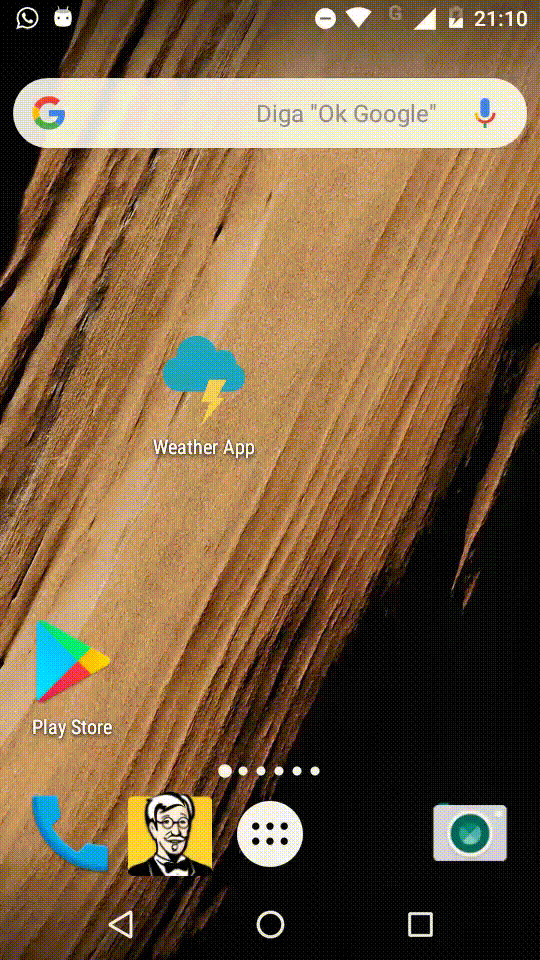
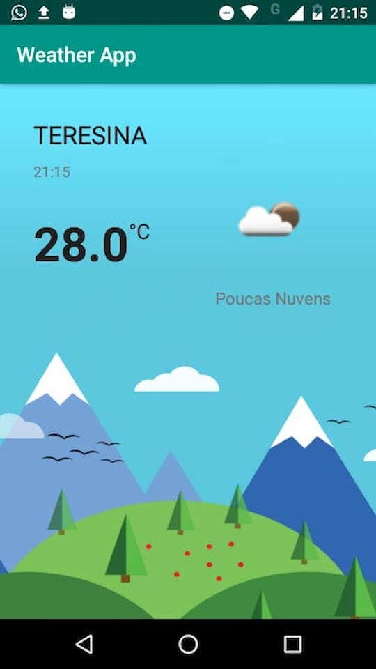

# WeatherApp

Projeto WeatherApp, desenvolvido em Kotlin, onde é feito uma requisição para um endpoint e posteriormente exibido em outra Acitivty.

# Instalação
- Está anexado neste projeto o arquivo apk. A apk pode ser baixado clicando 
[aqui](https://github.com/0tavi0/WeatherApp/blob/master/app.apk).
- Através do terminal execute o clone do projeto no GitHub

  	```git clone git@github.com:0tavi0/WeatherApp.gitt.git . Com o projeto clonado, execute o comando abaixo para instalar as dependências do projeto.
 
 # ScreenShots
 <p align="center">
   
   
 </p>
 
 # Projeto
O projeto consiste em mostrar o tempo da localização atual do dispositivo. 
- Utiliza a API [OpenWeatherMap](https://openweathermap.org/api) para obter os dados do tempo.

## Arquitetura
Neste projeto utilizei a arquitetura MVP pela facilidade de manutenção e futuras implementações.

## Bibliotecas
- [Retrofit](https://square.github.io/retrofit/): Biblioteca escolhida para requisições das APIs.
- [Gson](https://github.com/google/gson): Biblioteca da Google, para deserializar o retorno da API.
- [Picasso](http://square.github.io/picasso/): Biblioteca para carregamento de imagens.

# Author
- Otávio Augusto - otavio.le@gmail.com </br>
 
[](https://www.linkedin.com/in/otavio-augusto-776861116/)